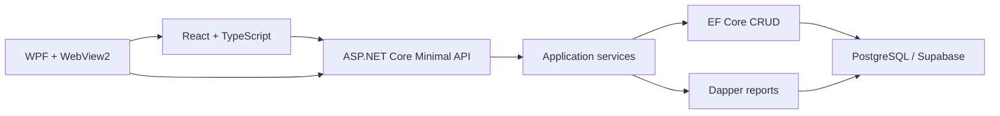

# Warehouse & Invoicing App

[](https://github.com/ThuanNg05/eCommerce/actions/workflows/ci.yml)

Ứng dụng quản lý kho, vật tư, khách hàng và hóa đơn dành cho cơ sở kinh doanh
nhỏ/vừa. Hệ thống gồm giao diện React, ASP.NET Core Minimal API và ứng dụng
desktop Windows dùng WPF + WebView2.

> **Trạng thái phát hành:** dự án đang trong giai đoạn hoàn thiện và chưa nên
> triển khai công khai. Trước khi chuyển repository sang public hoặc dùng trong
> production, cần thay toàn bộ dữ liệu seed bằng dữ liệu giả lập và loại bỏ tài
> khoản bootstrap mặc định.

## Chức năng chính

- Quản lý sản phẩm, vật tư, danh mục, khách hàng và tồn kho.
- Điều chỉnh kho, ghi nhận giao dịch và chuyển đổi nguyên vật liệu.
- Lập, cập nhật và phát hành hóa đơn.
- Quản lý bảng giá và cấu phần sản phẩm.
- Báo cáo doanh thu, sản phẩm, khách hàng và luồng tồn kho.
- Phân quyền người dùng, quản lý phiên đăng nhập và nhật ký kiểm toán.
- Cấu hình SMTP; app password được mã hóa trước khi lưu vào database.
- Upload ảnh sản phẩm, chuyển đổi sang WebP và lưu trên Supabase Storage.
- Chạy dưới dạng web development environment hoặc ứng dụng desktop Windows.

## Kiến trúc



Trong development, Vite chạy tại `http://localhost:5173` và proxy `/api`,
`/health` sang API tại `http://localhost:5080`. Khi chạy Desktop, WPF host API
trong cùng process tại `https://localhost:5443` và phục vụ React bundle qua
WebView2 tại `https://app.local`.

Ứng dụng cần kết nối tới PostgreSQL/Supabase để sử dụng các chức năng nghiệp vụ;
không hỗ trợ thao tác database khi offline.

## Công nghệ

| Thành phần | Công nghệ |
|---|---|
| Desktop | WPF, WebView2, `net10.0-windows` |
| Frontend | React 18, TypeScript, Vite, Material UI, AG Grid, TanStack Query |
| Backend | ASP.NET Core Minimal API, .NET 10 |
| Data access | EF Core 10 cho CRUD, Dapper cho báo cáo |
| Database | PostgreSQL trên Supabase |
| Authentication | JWT, server-side session, role-based authorization |
| Testing | xUnit, EF Core InMemory, Coverlet |
| CI | GitHub Actions, Gitleaks, NuGet/npm audit |

## Yêu cầu môi trường

- Windows 10/11 nếu chạy ứng dụng WPF.
- [.NET SDK 10.0.400](https://dotnet.microsoft.com/download/dotnet/10.0), được
  cố định trong [`global.json`](global.json).
- Node.js `^20.19.0` hoặc `>=22.12.0` và npm.
- PostgreSQL/Supabase project đã được cấu hình schema.
- Git Bash để dùng [`run.sh`](run.sh) trên Windows.
- WebView2 Runtime khi chạy Desktop.

## Quick Start

### 1. Clone và restore

```bash
git clone https://github.com/ThuanNg05/eCommerce.git
cd eCommerce
dotnet tool restore
dotnet restore eCommerce.sln
```

Không cần chạy `npm install` thủ công nếu dùng `run.sh`: script sẽ kiểm tra
`web/node_modules` và tự cài dependency trong lần chạy đầu tiên.

### 2. Cấu hình database

Ứng dụng đọc connection string từ key `ConnectionStrings:Default`. Không thêm
connection string thật vào `appsettings.json` hoặc commit nó vào Git.

Lấy pooler connection string trong Supabase Dashboard, sau đó bật xác minh TLS.
Ví dụ cấu trúc, không phải credential thật:

```text
Host=<pooler-host>;Port=5432;Database=postgres;Username=<runtime-user>;Password=<db-password>;SSL Mode=VerifyFull
```

Với API development, lưu bằng .NET User Secrets:

```powershell
dotnet user-secrets --project src/WarehouseApp.Api set `
  "ConnectionStrings:Default" `
  "<connection-string>"
```

Hoặc đặt biến môi trường cho PowerShell session hiện tại. Cách này cũng được
Desktop host sử dụng:

```powershell
$env:ConnectionStrings__Default = "<connection-string>"
```

Nên dùng database role dành riêng cho backend và chỉ cấp các quyền tối thiểu cần
thiết. Không đưa Supabase service-role key hoặc database password vào frontend.

### 3. Áp dụng migration

Schema được quản lý bởi các file SQL trong
[`supabase/migrations`](supabase/migrations), không phải EF migration runtime.
Với database mới, chạy tất cả file `.sql` theo thứ tự tên tăng dần bằng Supabase
SQL Editor hoặc quy trình migration của môi trường triển khai.

Khi thêm migration mới:

1. Dùng tên `YYYYMMDDHHMMSS_mo_ta.sql`.
2. Cập nhật `public.app_schema_version` trong migration.
3. Đồng bộ `DatabaseReadiness:RequiredSchemaVersion` ở cấu hình API và Desktop.
4. Chạy `./scripts/Test-Migrations.ps1` trước khi commit.

Không sửa hoặc chạy lại migration đã được áp dụng trên shared database; hãy tạo
migration kế tiếp để thay đổi schema.

### 4. Tạo SMTP encryption key

SMTP app password cần một AES-256-GCM key riêng, gồm 32 byte và được biểu diễn
bằng Base64. Tạo key và lưu vào User Secrets:

```powershell
$smtpKeyBytes = New-Object byte[] 32
$smtpRng = [Security.Cryptography.RandomNumberGenerator]::Create()
$smtpRng.GetBytes($smtpKeyBytes)
$smtpRng.Dispose()
$smtpKey = [Convert]::ToBase64String($smtpKeyBytes)
dotnet user-secrets --project src/WarehouseApp.Api set `
  "SmtpPasswordEncryption:Key" $smtpKey
[Array]::Clear($smtpKeyBytes, 0, $smtpKeyBytes.Length)
$smtpKey = $null
```

Khi chạy Desktop hoặc production, truyền cùng giá trị qua secret store hay biến
môi trường `SmtpPasswordEncryption__Key`. Mọi instance cần giải mã SMTP password
phải dùng cùng một key.

Migration `20260812193000_protect_smtp_password.sql` chủ động xóa plaintext cũ.
Sau khi áp dụng migration, quản trị viên phải nhập lại SMTP app password một lần.

### 5. Chạy development environment

Từ Git Bash trên Windows:

```bash
./run.sh
```

Script sẽ:

- cài frontend dependency nếu chưa có `web/node_modules`;
- giải phóng port `5080` và `5173`;
- chạy API và Vite dev server;
- mở hoặc refresh trang `http://localhost:5173`;
- dừng cả hai process khi nhấn `Ctrl+C`.

Nếu chỉ cấu hình database bằng User Secrets hoặc environment variable,
`run.sh` có thể vẫn hiển thị cảnh báo thiếu `appsettings.Development.json`. Đây
là cảnh báo preflight; backend vẫn đọc các configuration provider còn lại.

### Chạy thủ công

Mở hai terminal tại repository root:

```powershell
# Terminal 1 - API
dotnet run --project src/WarehouseApp.Api --launch-profile http
```

```powershell
# Terminal 2 - Frontend
Set-Location web
npm install
npm run dev
```

Mở `http://localhost:5173`.

### Chạy ứng dụng Desktop

```powershell
Set-Location web
npm install
npm run build
Set-Location ..
dotnet run --project src/WarehouseApp.Desktop
```

Desktop yêu cầu `ConnectionStrings__Default` và
`SmtpPasswordEncryption__Key` trong environment nếu chức năng SMTP được sử dụng.

## Configuration

| Key | Bắt buộc | Mục đích | Nơi lưu khuyến nghị |
|---|---:|---|---|
| `ConnectionStrings:Default` | Có | Kết nối PostgreSQL | User Secrets hoặc managed secret store |
| `SupabaseStorage:Url` | Khi dùng ảnh sản phẩm | Project URL của Supabase Storage | Environment variable trên backend |
| `SupabaseStorage:ServiceRoleKey` | Khi dùng ảnh sản phẩm | Secret key để API upload/xóa object | Environment variable hoặc managed secret store |
| `SupabaseStorage:Bucket` | Không | Bucket ảnh sản phẩm, mặc định `product-images` | `appsettings.json` không chứa secret |
| `SmtpPasswordEncryption:Key` | Khi dùng SMTP | Mã hóa/giải mã SMTP app password | User Secrets hoặc managed secret store |
| `Authentication:SigningKey` | Production | Ký JWT giữa các lần chạy/instance | Managed secret store |
| `DatabaseReadiness:RequiredSchemaVersion` | Có | Kiểm tra database đúng schema | `appsettings.json`, không chứa secret |

Trong environment variable, thay dấu `:` bằng `__`, ví dụ
`Authentication__SigningKey`.

Nếu không cấu hình JWT signing key trên Windows, ứng dụng tạo một key 256-bit tại
`%LOCALAPPDATA%/WarehouseApp/security/jwt-signing-key.bin` và bảo vệ bằng DPAPI.
Production nhiều instance phải dùng một signing key chung từ secret store.

Ảnh sản phẩm được API chuyển sang WebP và upload vào bucket public
`product-images`. Chỉ backend được dùng `SupabaseStorage:ServiceRoleKey`; không
đặt key này trong `web/`, biến `VITE_*` hoặc source code.

## API và phân quyền

| Nhóm route | Quyền truy cập | Nội dung |
|---|---|---|
| `/health`, `/health/live` | Public | Liveness |
| `/health/ready` | Public | Database và schema readiness |
| `/api/auth/*` | Tùy endpoint | Login, refresh, logout, đổi mật khẩu, thông tin phiên |
| `/api/inventory`, `/api/invoices`, `/api/customers` | Đã đăng nhập và đã đổi mật khẩu | Nghiệp vụ kho, hóa đơn, khách hàng |
| `/api/categories`, `/api/materials`, `/api/backboards`, `/api/sub-backboards`, `/api/frames` | Đã đăng nhập và đã đổi mật khẩu | Dữ liệu danh mục và nguyên vật liệu |
| `/api/inventory-transactions` | Đã đăng nhập và đã đổi mật khẩu | Giao dịch kho và chuyển đổi |
| `/api/accounts`, `/api/audit`, `/api/pricing`, `/api/reports`, `/api/settings` | Admin | Quản trị, báo cáo và cấu hình |

API trả lỗi nghiệp vụ theo `ProblemDetails`; các trường hợp phổ biến gồm `400`
cho validation, `404` khi không tìm thấy và `409` khi xảy ra concurrency conflict.

## Bảo mật

- JWT access token có thời hạn 15 phút; server-side session có thời hạn 8 giờ.
- Mỗi tài khoản chỉ có một phiên hoạt động; login mới thu hồi phiên trước.
- Login bị rate limit và tài khoản bị khóa tạm thời sau nhiều lần sai mật khẩu.
- Mật khẩu tạm thời buộc người dùng đổi trước khi truy cập nghiệp vụ.
- Mật khẩu tài khoản được hash bằng BCrypt; SMTP app password cần được giải mã để
  gửi mail nên được mã hóa xác thực bằng AES-256-GCM, không hash bằng BCrypt.
- Tồn kho dùng optimistic concurrency qua PostgreSQL `xmin`; xung đột trả HTTP
  `409`.
- Không commit connection string, password, signing key, encryption key hoặc file
  `.env` chứa secret.

Trước khi public repository hoặc deploy production:

- thay dữ liệu khách hàng trong seed migration bằng dữ liệu giả lập;
- loại bỏ hoặc thay cơ chế tạo tài khoản bootstrap mặc định;
- rotate toàn bộ credential từng xuất hiện ngoài secret store;
- bật xác minh chứng chỉ TLS đầy đủ cho kết nối database;
- dùng database role backend-only với least privilege;
- cung cấp chứng chỉ HTTPS tin cậy cho API chạy trong Desktop host.

## Cấu trúc repository

```text
eCommerce/
├── src/
│   ├── WarehouseApp.Core/            # Entity, DTO, enum và abstraction
│   ├── WarehouseApp.Infrastructure/  # EF Core, Dapper, service và security
│   ├── WarehouseApp.Api/             # Minimal API và composition root
│   └── WarehouseApp.Desktop/         # WPF + WebView2 host
├── web/                              # React + TypeScript + Vite
├── tests/WarehouseApp.Security.Tests/ # Automated tests
├── supabase/migrations/              # SQL migration theo thứ tự
├── scripts/                          # Migration và dependency checks
├── docs/                             # ADR và tài liệu kỹ thuật
├── .github/workflows/ci.yml          # CI pipeline
├── global.json                       # Phiên bản .NET SDK
├── run.sh                            # Development launcher cho Windows Git Bash
└── eCommerce.sln
```

Dependency direction chính:

```text
Desktop -> API -> Infrastructure -> Core
```

## Build và kiểm thử

```powershell
# Backend, Desktop và test projects
dotnet restore eCommerce.sln
dotnet build eCommerce.sln --configuration Release --no-restore
dotnet test eCommerce.sln --configuration Release --no-build

# Frontend
Set-Location web
npm ci
npm run build
Set-Location ..

# Kiểm tra migration và NuGet vulnerability
./scripts/Test-Migrations.ps1
./scripts/Test-NuGetVulnerabilities.ps1
```

GitHub Actions hiện kiểm tra .NET build/test, frontend production build, NuGet và
npm audit, migration consistency, Gitleaks và desktop publish artifact.

## Tài liệu liên quan

- [ADR-001: In-process API cho mô hình ba thiết bị](docs/adr/ADR-001-in-process-api-for-three-device-pilot.md)
- [Database access inventory](docs/security/DATABASE_ACCESS_INVENTORY.md)

## Giới hạn hiện tại

- Chưa tích hợp máy in nhiệt, máy quét barcode hoặc cân điện tử.
- Desktop production cần quy trình cấp và gia hạn localhost HTTPS certificate.
- Database là dịch vụ ngoài ứng dụng; mất kết nối sẽ làm gián đoạn nghiệp vụ.
- Repository chưa có license, vì vậy chưa mặc định cấp quyền sử dụng, sửa đổi hoặc
  phân phối lại mã nguồn.
